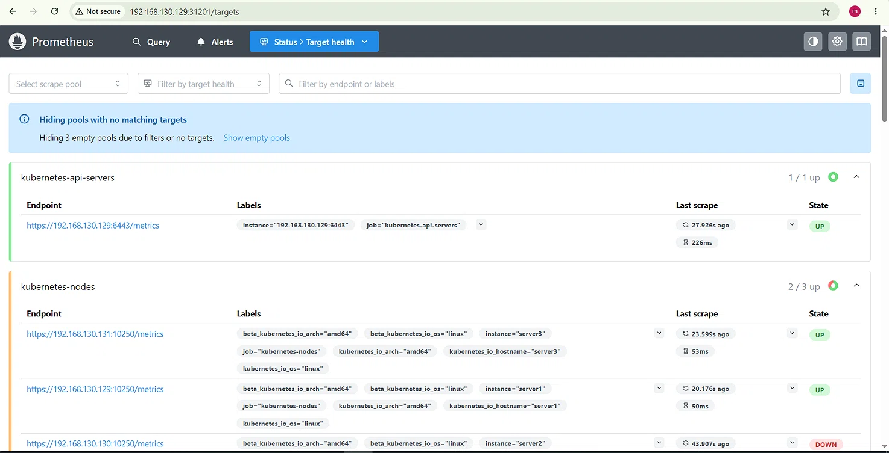
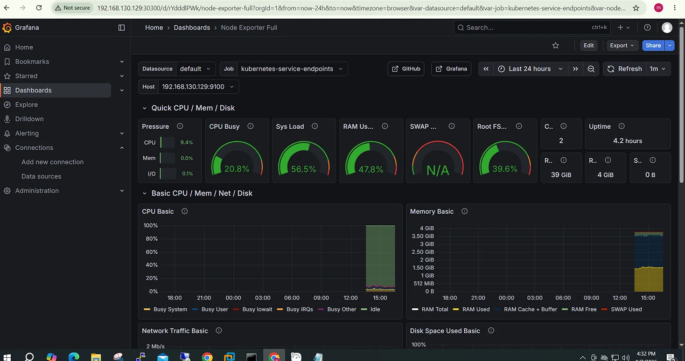
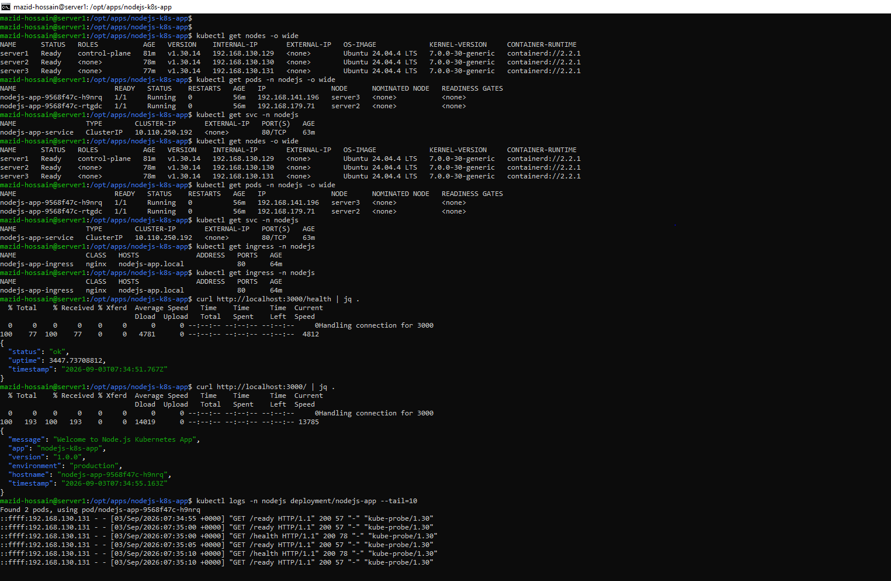

# 🚀 Production-Ready Node.js Application on Kubernetes with Helm

[](https://kubernetes.io/)
[](https://helm.sh/)
[](https://www.docker.com/)
[](https://nodejs.org/)
[]()

---

## 📋 Project Overview

Production-grade deployment of a **Node.js application** on a **3-node Kubernetes cluster** on **VMware** infrastructure. Deployed with **Helm**, exposed via **Nginx Ingress**, auto-scaling with **HPA**, and monitored with **Prometheus & Grafana**.

---

## 🛠️ Technology Stack

| Component | Technology | Version |
|-----------|------------|---------|
| **Application** | Node.js (Express) | 18.x |
| **Containerization** | Docker (Multi-stage) | 20.10 |
| **Orchestration** | Kubernetes | v1.30.14 |
| **Package Manager** | Helm | v3.21.4 |
| **CNI** | Calico | v3.28.0 |
| **Ingress** | Nginx Ingress | v1.11.1 |
| **Monitoring** | Prometheus + Grafana | Latest |
| **Infrastructure** | VMware (Ubuntu 24.04) | - |

---


## 🏗️ Infrastructure

| VM | Role | IP Address | Specs |
|----|------|------------|-------|
| **server1** | Master (Control Plane) | 192.168.130.129 | 4GB RAM, 2 vCPU |
| **server2** | Worker Node | 192.168.130.130 | 2GB RAM, 2 vCPU |
| **server3** | Worker Node | 192.168.130.131 | 2GB RAM, 2 vCPU |


## 🚀 Deployment Commands

```bash
# 1. Clone repository
git clone https://github.com/mazid-dev/production-ready-nodejs-k8s-helm.git
cd production-ready-nodejs-k8s-helm

# 2. Deploy with Helm
helm install nodejs-app ./helm-chart/nodejs-app \
  --namespace nodejs \
  --create-namespace \
  --set persistence.enabled=false \
  --set image.repository=mdmazidhossain77/nodejs-k8s-app \
  --set image.tag=latest


# 3. Verify
kubectl get pods -n nodejs -o wide
kubectl get svc -n nodejs
kubectl get ingress -n nodejs
kubectl get hpa -n nodejs

🧪 Testing
bash
# Health Check
curl -H "Host: nodejs-app.local" http://192.168.130.129:32365/health

# Application Info
curl -H "Host: nodejs-app.local" http://192.168.130.129:32365/
Response:

json
{"status":"ok","uptime":2970.219,"timestamp":"2026-09-07T09:54:17.422Z"}
📊 Monitoring
Service	URL
Grafana	http://192.168.130.129:30300 (admin/admin)
Prometheus	http://192.168.130.129:31201

📸 Screenshots
All screenshots available in screenshots/ directory.

#	Screenshot	Description
1	01-nodes.txt	3 Nodes Ready
2	02-pods.txt	Pods Running
3	03-services.txt	Services
4	04-ingress.txt	Ingress
5	05-hpa.txt	HPA Auto-scaling
| 6 |  | Prometheus Targets |
| 7 |  | Grafana Dashboard |
| 8 |  | Services & Health Check |

🎯 Features
Feature	Status
3-Node Kubernetes Cluster	✅
Node.js Application	✅
Docker Multi-stage Build	✅
Helm Charts	✅
Nginx Ingress	✅
Health Checks	✅
HPA Auto-scaling	✅
Prometheus + Grafana	✅
Persistent Volume	✅
Non-root User Security	✅

🔗 Links
GitHub: github.com/mazid-dev/production-ready-nodejs-k8s-helm

Docker Hub: hub.docker.com/r/mdmazidhossain77/nodejs-k8s-app
